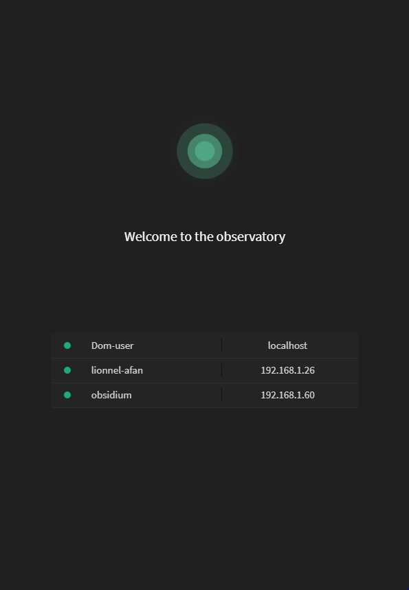

# Welcome to Observer !

**Observer** is a simple express based authentication server that uses electron for UI and Angular js.

<div align="center">


</div>

## What does it do?

* it __receives users authentication requests__ check if user is not already logged-in and generate a Token, then returns a list of connected users.
* it __returns connected users list__ base on resquesting user ip address and Token.
* it __handle logout requests__ then remove user from connected users list.
* it is __easily customizable and extensible__

> **Note:** This version doesn't store anything in Database so once the **Observer**  is closed every session will be lost.


## How does it work?

There are __3 main Actions__ - the authentication request, a users list request and a logout request.

The __authentication request__. It provides an endpoint for
__authenticating and initiating the session__ and then returns a list of currently connected users. Simply send an http post to
* http://__oberser address__:8080/observer/api/__login__

using  :

```
{
	"login" : "the username",
	"password" : "a password"
}
```

The __users list request__ it provides an endpoint to fetch currently connected users list. Send an http post to : 
* http://__observer server address__:8080/observer/api/__users__

With : 
```
{
	"token" : "the current user's token"
}
```


The __logout request__, simply delete the resquesting user and related token form the list of connected users. Send an http post to : 

* http://__observer server address__:8080/observer/api/__logout__


## Installation 
Install npm packages
```
npm install
```
then run

```
gulp run
```
